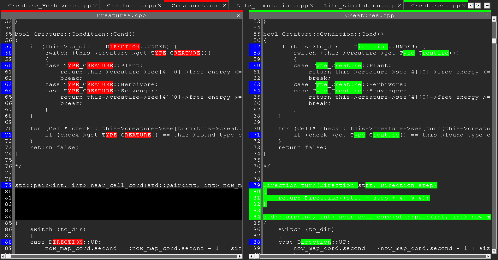
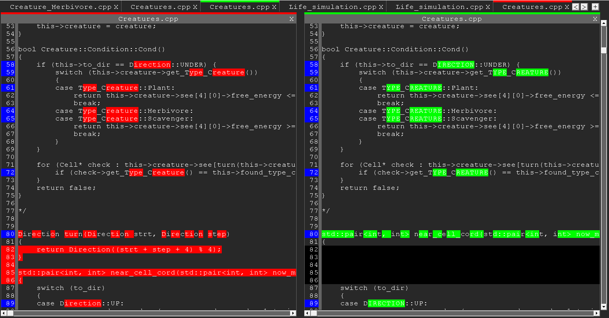

# Сравнение файлов (Графическое, Windows)

&emsp;&emsp;Можно добавлять много файлов, сравнивать их между собой, менять местами, удалять.\
&emsp;&emsp;Для этого используется алгоритм Diff построчно и посимвольно.

## Основная информация

### Стек технологий разработки

1. Visual Studio 2019: C++, Win API.

### Фото работы

1. Сейчас сравниваются два разных файла с именем Creatures.cpp. Из левого получаем правый, за счёт удаления всего красного и добавления всего зелёного.

1. Эти же файлы, но наоборот.

## Дата

&emsp;&emsp;Конец 2022г. Проект довольно сырой.

## Заключение

&emsp;&emsp;В основном используется, чтобы узнать, различаются файлы или нет. Проект сырой и поэтому неудобно пользоваться.

 ${\color{red}FIXME}$ 1) При табуляции все ещё едет иногда.\
 ${\color{red}FIXME}$ 2) Посимвольно сравнение.\
 ${\color{red}FIXME}$ 3) Иногда не работает горизонтальный скролл.\
 ${\color{yellow}TODO}$ 1) Добавить возможность редактировать.\
 ${\color{yellow}TODO}$ 1.5) Сделать возможность обменивать куски местами, чтобы была возможность решать конфликты.\
 ${\color{yellow}TODO}$ 2) Добавить общий горизонтальный скролл, который скролит оба одновременно.\
 ${\color{yellow}TODO}$ 3) Обработать кнопки pgUp, pgDn, Home, End, стрелочки, увеличить скорость прокрутки по кнопкам.\
 ${\color{yellow}TODO}$ 4) Сделать настройку, чтобы прокручивать не попиксельно, а построчно.\
 ${\color{yellow}TODO}$ 5) Сделать менее яркие цвета, чтобы не мешали читать.
 